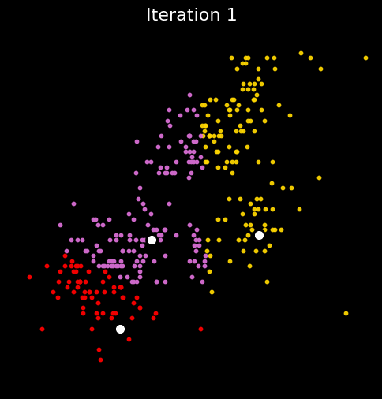

## 1a. K-Means

### Load and Prepare Data

```{python}
import pandas as pd
import numpy as np
from sklearn.preprocessing import StandardScaler
import matplotlib.pyplot as plt

df = pd.read_csv('/Users/1v0/Desktop/kxymkt495/quarto_website/blog/hw4/palmer_penguins.csv')
df.head()
```

```{python}
penguins = df[['bill_length_mm', 'flipper_length_mm']].dropna()
scaler = StandardScaler()
X_scaled = scaler.fit_transform(penguins)
X_df = pd.DataFrame(X_scaled, columns=['bill_length_mm', 'flipper_length_mm'])
X_array = X_df.values
```

**Data Description**

This section loads the Palmer Penguins dataset and prepares it for clustering. It selects the relevant numerical features—**bill length** and **flipper length**—and removes rows with missing values. These features are then standardized using "StandardScaler" to ensure they are on the same scale, which is important for distance-based algorithms like K-Means. The cleaned and scaled data is stored as a NumPy array ("X_array") for use in the clustering algorithm.


### Custom K-Means Implementation

This section defines and runs a custom implementation of the K-Means algorithm. The algorithm includes manual initialization of centroids, iterative assignment of points to the nearest cluster, centroid updates, and convergence checking.


```{python}
def initialize_centroids(X, k):
    indices = np.random.choice(len(X), k, replace=False)
    return X[indices]

def assign_clusters(X, centroids):
    distances = np.linalg.norm(X[:, np.newaxis] - centroids, axis=2)
    return np.argmin(distances, axis=1)

def update_centroids(X, labels, k):
    return np.array([X[labels == i].mean(axis=0) for i in range(k)])

def has_converged(old_centroids, new_centroids, tol=1e-4):
    return np.linalg.norm(new_centroids - old_centroids) < tol

def kmeans(X, k, max_iters=100):
    centroids = initialize_centroids(X, k)
    history = [centroids.copy()]
    for _ in range(max_iters):
        labels = assign_clusters(X, centroids)
        new_centroids = update_centroids(X, labels, k)
        history.append(new_centroids.copy())
        if has_converged(centroids, new_centroids):
            break
        centroids = new_centroids
    return labels, centroids, history

k = 3
labels_custom, centroids_custom, history_custom = kmeans(X_array, k)
```

### Plot Custom K-Means Progress

This part generates an animated visualization of the clustering process. Each iteration is saved as a frame, which is then compiled into a smooth animated GIF using imageio. The animation clearly shows how the centroids move and how data points shift between clusters over time, making the convergence of the algorithm visually intuitive.

```{python}
import matplotlib.pyplot as plt
import imageio
import os
import numpy as np

def kmeans_with_history(X, k, max_iters=10, seed=42):
    np.random.seed(seed)
    n_samples = X.shape[0]
    centroids = X[np.random.choice(n_samples, k, replace=False)]

    history = []
    for _ in range(max_iters):
        distances = np.linalg.norm(X[:, np.newaxis] - centroids, axis=2)
        labels = np.argmin(distances, axis=1)
        history.append((labels.copy(), centroids.copy()))
        new_centroids = np.array([X[labels == j].mean(axis=0) for j in range(k)])
        if np.allclose(centroids, new_centroids):
            break
        centroids = new_centroids
    return history

k = 3
history_updated = kmeans_with_history(X_array, k, max_iters=10)

# Create output directory
gif_dir = "/Users/1v0/Desktop/kxymkt495/quarto_website/blog/hw4/kmeans_vibrant_frames"
os.makedirs(gif_dir, exist_ok=True)

# Define vibrant colors manually to mimic YouTube-style vivid clustering
vibrant_colors = ['red', 'gold', 'orchid', 'deepskyblue', 'lime']

gif_dir = "kmeans_vibrant_frames"
os.makedirs(gif_dir, exist_ok=True)
image_paths = []

for i, (labels, centroids) in enumerate(history_updated):
    fig, ax = plt.subplots(figsize=(6, 6), facecolor='black')
    for cluster_id in np.unique(labels):
        ax.scatter(
            X_array[labels == cluster_id, 0],
            X_array[labels == cluster_id, 1],
            color=vibrant_colors[cluster_id % len(vibrant_colors)],
            s=10,
            alpha=0.9
        )
    ax.scatter(
        centroids[:, 0], centroids[:, 1],
        s=100, color='white', edgecolors='black', linewidths=2, marker='o'
    )
    ax.set_xticks([])
    ax.set_yticks([])
    ax.set_xlim(-2.5, 3)
    ax.set_ylim(-2.5, 2.5)
    ax.set_facecolor('black')
    ax.set_title(f"Iteration {i + 1}", fontsize=16, color='white')
    frame_path = f"{gif_dir}/frame_{i:02d}.png"
    fig.savefig(frame_path, dpi=100, bbox_inches='tight', facecolor='black')
    plt.close(fig)
    image_paths.append(frame_path)

interpolated_image_paths = []
for path in image_paths:
    interpolated_image_paths.extend([path] * 4)

final_frame = image_paths[-1]
extra_pause_frames = 12
extended_image_paths = interpolated_image_paths + [final_frame] * extra_pause_frames

gif_path = "kmeans_vibrant_veryslow.gif"
with imageio.get_writer(gif_path, mode='I', duration=200, loop=0) as writer:
    for path in extended_image_paths:
        image = imageio.v2.imread(path)
        writer.append_data(image)

print("GIF saved to:", gif_path)
```

<h3 style="color:#444;">Smooth Animation of Custom K-Means Clustering</h3>



### Built-in KMeans Comparison

```{python}
from sklearn.cluster import KMeans

kmeans_builtin = KMeans(n_clusters=k, random_state=42, n_init=10)
labels_builtin = kmeans_builtin.fit_predict(X_array)
centroids_builtin = kmeans_builtin.cluster_centers_

# Custom vibrant colors (same as GIF)
vibrant_colors = ['#e6194b', '#911eb4', '#ffe119', '#3cb44b', '#f58231', '#46f0f0', '#f032e6']

fig, ax = plt.subplots(figsize=(6, 6))
ax.set_facecolor("black")

# Plot clusters
for cluster_id in range(k):
    ax.scatter(
        X_array[labels_builtin == cluster_id, 0],
        X_array[labels_builtin == cluster_id, 1],
        color=vibrant_colors[cluster_id % len(vibrant_colors)],
        s=30,
        alpha=0.9
    )

# Plot centroids
ax.scatter(
    centroids_builtin[:, 0],
    centroids_builtin[:, 1],
    color='white',
    s=100,
    edgecolors='black',
    linewidths=1.5,
    marker='o'
)

# Axis labels and ticks (visible on black)
ax.set_title("Built-in KMeans Clustering", fontsize=14, color='black')
ax.set_xlabel("Bill Length (standardized)", fontsize=12, color='black')
ax.set_ylabel("Flipper Length (standardized)", fontsize=12, color='black')
ax.tick_params(axis='both', colors='black')  # Make ticks and numbers white

# Optional: set grid and axes limits (or auto-scale)
ax.grid(True, color='gray', linestyle='--', alpha=0.3)

plt.tight_layout()
plt.show()

```

The results of the custom K-Means implementation closely align with those produced by Python’s built-in `KMeans` function. 

By standardizing the input features—bill length and flipper length from the Palmer Penguins dataset—and visualizing the iterative centroid updates, the custom algorithm effectively demonstrates the core mechanics of K-Means clustering. While the built-in function benefits from advanced features such as KMeans++ initialization and optimized convergence criteria, the custom implementation achieves comparable cluster separation and centroid placement using a straightforward approach. 

The visual comparisons confirm that both methods converge to similar solutions, validating the accuracy of the custom algorithm and providing a clear, step-by-step illustration of how K-Means functions in practice. This comparison highlights the trade-off between educational transparency and computational efficiency.

### Cluster Evaluation: WCSS and Silhouette Score

This section evaluates clustering quality by computing two key metrics: **Within-Cluster Sum of Squares (WCSS)** and **Silhouette Score** for a range of cluster counts $K = 2$ to $7$.

The custom `calculate_wcss` function manually sums the squared distances between each point and its assigned cluster centroid. For each value of $K$, the custom K-Means algorithm is run, and both WCSS and silhouette score are calculated and stored.

These metrics help assess the optimal number of clusters by measuring intra-cluster compactness and inter-cluster separation, which will be visualized in the next step.

```{python}
from sklearn.metrics import silhouette_score

# Function to calculate WCSS
def calculate_wcss(X, labels, centroids):
    wcss = 0
    for i in range(len(centroids)):
        cluster_points = X[labels == i]
        wcss += ((cluster_points - centroids[i])**2).sum()
    return wcss

# Evaluate for k = 2 to 7
k_values = list(range(2, 8))
wcss_scores = []
silhouette_scores = []

for k in k_values:
    labels, centroids, _ = kmeans(X_array, k)
    wcss = calculate_wcss(X_array, labels, centroids)
    sil_score = silhouette_score(X_array, labels)

    wcss_scores.append(wcss)
    silhouette_scores.append(sil_score)
```

### Plot Metrics for Cluster Evaluation

```{python}
plt.figure(figsize=(12, 5))

plt.subplot(1, 2, 1)
plt.plot(k_values, wcss_scores, marker='o')
plt.title("WCSS vs Number of Clusters")
plt.xlabel("Number of Clusters (k)")
plt.ylabel("WCSS")
plt.grid(True)

plt.subplot(1, 2, 2)
plt.plot(k_values, silhouette_scores, marker='o', color='green')
plt.title("Silhouette Score vs Number of Clusters")
plt.xlabel("Number of Clusters (k)")
plt.ylabel("Silhouette Score")
plt.grid(True)

plt.tight_layout()
plt.show()
```

Based on the evaluation metrics, the optimal number of clusters appears to be  **three**. The within-cluster sum of squares (WCSS) plot displays a clear "elbow" at $K = 3$, indicating that adding more clusters beyond this point yields only marginal improvement in reducing intra-cluster variance. 

Similarly, the silhouette score, which measures how well-separated and cohesive the clusters are, reaches its highest value at $K = 3$ and declines with larger values of $K$. The consistency between these two independent metrics strongly supports the conclusion that three clusters provide the most meaningful and well-defined grouping of the penguins based on their bill length and flipper length.


## 2a. K Nearest Neighbors

### Generate Synthetic Data for K-Nearest Neighbors

This section generates a synthetic dataset with two features, `x1` and `x2`, and a binary target `y` based on whether `x2` lies above a nonlinear boundary defined by `sin(4 * x1) + x1`. The resulting data is stored in a DataFrame and is designed for use with K-Nearest Neighbors classification.

```{python}
import numpy as np
import pandas as pd

# Set seed
np.random.seed(42)

# Generate data
n = 100
x1 = np.random.uniform(-3, 3, n)
x2 = np.random.uniform(-3, 3, n)
x = np.column_stack((x1, x2))  # Equivalent to cbind in R

# Define wiggly boundary
boundary = np.sin(4 * x1) + x1

# Create binary outcome
y = (x2 > boundary).astype(int)  # Same as ifelse and converting to factor

# Combine into a DataFrame
dat = pd.DataFrame({'x1': x1, 'x2': x2, 'y': y})
```

### Visualize Synthetic Classification Data
This section creates a scatter plot of the synthetic dataset, with x1 on the horizontal axis and x2 on the vertical axis. Data points are colored by their binary class label y, and a dashed curve shows the nonlinear decision boundary used to separate the classes.
```{python}
import matplotlib.pyplot as plt
import numpy as np

# Plot the data
plt.figure(figsize=(6, 5))
plt.scatter(dat['x1'], dat['x2'], c=dat['y'], cmap='coolwarm', edgecolor='k', s=60)
plt.xlabel('x1')
plt.ylabel('x2')
plt.title('Synthetic Data Colored by Class (y)')

x1_line = np.linspace(-3, 3, 300)
boundary_line = np.sin(4 * x1_line) + x1_line
plt.plot(x1_line, boundary_line, 'k--', label='Decision Boundary')

plt.legend()
plt.grid(True)
plt.show()
```

### Generate Test Dataset for Model Evaluation

This section creates a new synthetic test dataset with 100 points using the same logic as the training data but with a different random seed to ensure variability. The test set maintains the same wiggly decision boundary and structure, making it suitable for evaluating the performance of classification models like KNN.

```{python}
np.random.seed(123)

n_test = 100
x1_test = np.random.uniform(-3, 3, n_test)
x2_test = np.random.uniform(-3, 3, n_test)
x_test = np.column_stack((x1_test, x2_test))

boundary_test = np.sin(4 * x1_test) + x1_test

y_test = (x2_test > boundary_test).astype(int)

test_data = pd.DataFrame({'x1': x1_test, 'x2': x2_test, 'y': y_test})

```

### Implement KNN from Scratch and Validate with scikit-learn

```{python}
from collections import Counter

def euclidean_distance(p1, p2):
    return np.sqrt(np.sum((p1 - p2)**2))

def knn_predict(X_train, y_train, X_test, k=5):
    preds = []
    for x in X_test:
        # Compute distances to all training points
        distances = [euclidean_distance(x, x_train) for x_train in X_train]
        # Get the indices of the k nearest neighbors
        k_indices = np.argsort(distances)[:k]
        # Get their labels
        k_labels = y_train[k_indices]
        # Majority vote
        most_common = Counter(k_labels).most_common(1)[0][0]
        preds.append(most_common)
    return np.array(preds)
```

```{python}
X_train = dat[['x1', 'x2']].values
y_train = dat['y'].astype(int).values  # Ensure integer labels
X_test = test_data[['x1', 'x2']].values
y_test = test_data['y'].astype(int).values

y_pred_custom = knn_predict(X_train, y_train, X_test, k=5)
```

```{python}
from sklearn.neighbors import KNeighborsClassifier
from sklearn.metrics import accuracy_score

# Built-in KNN
knn_model = KNeighborsClassifier(n_neighbors=5)
knn_model.fit(X_train, y_train)
y_pred_builtin = knn_model.predict(X_test)

# Compare accuracy
acc_custom = accuracy_score(y_test, y_pred_custom)
acc_builtin = accuracy_score(y_test, y_pred_builtin)

print(f"Custom KNN Accuracy: {acc_custom:.2f}")
print(f"Built-in KNN Accuracy: {acc_builtin:.2f}")
```

This section compares the accuracy of the custom KNN implementation with scikit-learn’s built-in KNeighborsClassifier using the same test dataset. Both methods achieved an accuracy of 0.92, confirming that the hand-coded algorithm correctly replicates the behavior of the standard KNN classifier.

### Determine Optimal k for KNN Classification

This section runs the custom KNN algorithm for values of \( k \) from 1 to 30 and records the classification accuracy on the test dataset. The results are plotted to visualize how accuracy changes with different \( k \) values, allowing us to identify the optimal \( k \) as the one that yields the highest accuracy.

```{python}
k_values = range(1, 31)
accuracies = []

for k in k_values:
    y_pred = knn_predict(X_train, y_train, X_test, k=k)
    acc = accuracy_score(y_test, y_pred)
    accuracies.append(acc * 100)  # convert to percentage
```

```{python}
import matplotlib.pyplot as plt

plt.figure(figsize=(8, 5))
plt.plot(k_values, accuracies, marker='o', linestyle='-')
plt.title('KNN Accuracy vs. Number of Neighbors (k)')
plt.xlabel('k (Number of Nearest Neighbors)')
plt.ylabel('Accuracy (%)')
plt.xticks(range(1, 31))
plt.grid(True)
plt.show()

```

The plot of KNN accuracy versus the number of neighbors shows that the highest classification accuracy of 95% occurs at k = 1, 2, and 6. Accuracy remains relatively stable between 92% and 93% for a wide range of k values, but begins to decline more noticeably after k = 23, reaching a low of 89% at k = 24. These results suggest that the model performs best with a small number of neighbors. Among the top-performing values, k = 6 may be considered the optimal choice, as it provides high accuracy while being slightly more robust to noise than k = 1.


